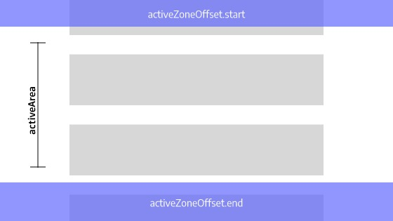

# Scrollspy.js

* [Scrollspy.js](https://raw.githubusercontent.com/fluffy-factory/toolbox/master/src/js/modules/Scrollspy.js)

**Config:**
```js
{
  navLinks: [], // NodeList || NodeList[]
  activeClass: 'is-active',
  activeZoneOffset: {start: 0, end: 0},
  activeCallback: null, // null || Function
  notActiveCallback: null, // null || Function
  clickCallback: null, // null || Function
}
```

**Callbacks**  
You have access to the curent link and target
```js
{
  ...
  activeCallback: ({link, target}) => {
    // ...
  },
  notActiveCallback: ({link, target}) => {
    // ...
  },
  clickCallback: ({targetOffset}) => {
    // An example to add a smooth scroll
    Velocity(document.body, 'scroll', {
      offset: targetOffset - 60, // 60 = header height
      duration: 1000
    });
	}
}
```

  

<Scrollspy-Scrollspy></Scrollspy-Scrollspy>